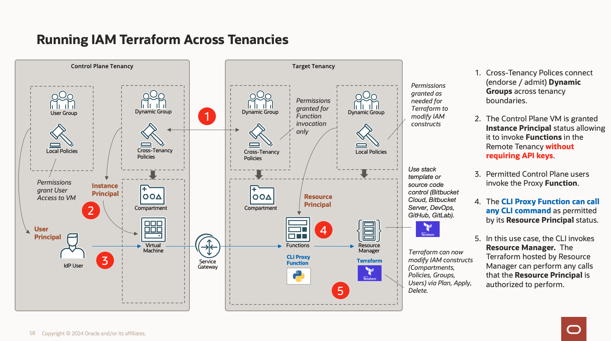

# Use Case: Run Landing Zone Terraform Across Tenancies

DevOps teams frequently want to use one OCI tenancy serve as a `Control Plane` that can manage target tenancies.
A key requirement for this type of arrangement: **strict avoidance of any API key, auth token or key-pair sharing
across tenancies.**

OCI supports a cross-tenancy principal relationship declarative mechanism that makes this straightforward to set up.
OCI also supports a fully-managed, hosted Terraform Service 
called [Resource Manager](https://www.oracle.com/devops/resource-manager/). The service provides the full 
range of OCI API access via the [OCI terraform provider](https://registry.terraform.io/providers/oracle/oci/latest/docs).

## So ... Why is this Needed?  

Due to compliance requirements, an OCI tenancy's IAM security constructs are blocked from being modified by any 
externally resolved principal ... even if all required cross-tenancy policies are in place.  That will prevent
any Terraform IaC from provisioning or modifying any of these:

* Compartments
* Identity Domains
* Groups
* Users
* Policies

## Solution
This sample demonstrates
how to work around that restriction by using an OCI Function to proxy CLI calls within the remote tenancy. 

### Consult your SecOps Team

The security aspects of this architecture do not compromise the strength of OCI in any way as it requires 
strong policy grants on both tenancies.  **However, it is imperative that you consult with your SecOps teams 
before using this.**

---
# Tenancy Configuration

_Note: The following steps assume that you have Administrator privileges in both tenancies._

## Target Tenancy Configuration

Here are the resources that we need to create in the target tenancy:

* A compartment
* A VCN
* A Fn Application and Function
* A Cross-Tenancy Policy
* A Dynamic Group

### Compartment

Create a compartment.  We will call it `cli-target` for this exercise.

### Resource Principal Dynamic Group

Create a dynamic group called `cli-target-resource-dg` that encompasses Function resource principals
that reside in the `cli-target` compartment:

    ALL {resource.type = 'fnfunc', resource.compartment.id = 'ocid1.compartment.oc1...'}

### Cross-Tenancy Policy

Create a policy that enables the `cli-control-plane` tenancy and its `cli-control-plane-dg` dynamic group 
to be referenced in the target tenancy's policy statements.  That is accomplished with `define` statements.

We then add an `admit` statement, which allows the `cli-control-plane-dg` dynamic group to call this function.

    define tenancy cli-control-plane-tenancy AS ocid1.tenancy.oc1...
    define dynamic-group cli-control-plane-dg AS ocid1.dynamicgroup.oc1...
    admit dynamic-group cli-control-plane-dg OF tenancy cli-control-plane-tenancy to use functions-family IN compartment id ocid1.compartment.oc1...

### Resource Principal Policy

Create a local policy that `allows` the cli-target-resource-dg (the function itself) to 
manage Resource Manager related resources within this tenancy.  The final statement allows 
the function to manage all resources within the 

    allow dynamic-group cli-target-resource-dg to manage orm-stacks IN tenancy
    allow dynamic-group cli-target-resource-dg to manage orm-jobs IN tenancy
    allow dynamic-group cli-target-resource-dg to manage orm-templates IN tenancy
    allow dynamic-group cli-target-resource-dg to manage compartments IN tenancy
    allow dynamic-group cli-target-resource-dg to manage domains IN tenancy
    allow dynamic-group cli-target-resource-dg to manage all-resources IN compartment id ocid1.compartment.oc1...

---

# Control Plane Tenancy Configuration

There are a small number of resources that we need to create in the cli-control-plane tenancy:

* A Compartment
* A Cross-Tenancy Policy
* A Dynamic Group
* A VCN
* A Compute Node

### cli-control-plane Compartment

Create a compartment.  We will call it `cli-control-plane` for this exercise.

### Instance Principal Dynamic Group

Create a dynamic group called `cli-control-plane-dg` that encompasses VM instance principals:
that reside in the `cli-control-plane` compartment:

    instance.compartment.id = 'ocid1.compartment.oc1...'

### Cross-Tenancy Policy

Create a policy that enables this `cli-control-plane` tenancy and its `cli-control-plane-dg` dynamic group 
to become accessible from `cli-target` tenancy policy statements.  That is accomplished with `define` statement.
We then add an `endorse` statement, which allows the `cli-control-plane-dg` dynamic group to invoke the Function
over in the `cli-target` tenancy.

    define tenancy cli-target-tenancy AS ocid1.tenancy.oc1...
    endorse dynamic-group cli-control-plane-dg to use functions-family IN compartment id ocid1.compartment.oc1...

----
# The Function

The function itself is quite small and straightforward because the OCI command line interface is implemented in Python.
All it does is call a subprocess to execute the CLI command you give it.

The `Dockerfile` overrides the default behavior to resolve an oci-cli package path issue.

## Build and Deploy the Function

Build and deploy the function in the `cli-target `tenancy.   Note that you need to deploy this function 
in the tenancy's home region if you need to manipulate IAM
constructs (create compartments for example)

Please see the instruction here for an [Overview of OCI Function](https://docs.oracle.com/en-us/iaas/Content/Functions/Concepts/functionsoverview.htm).

## Two Ways to Invoke the Function

A function can be invoked using the `oci` command line itself or the `fn` command line.  The oci command line
method is more robust as it will work across tenancies or regions and does not require a compartment id, etc.

## Invoking the Function from Control Plane VM

You should now be able to ssh into the VM in the `cli-control-plane` tenancy and execute the CLI examples below.

## Invoking the Function from Developer Machine

You can also call the CLI proxy from a local developer machine.  _Just be aware that local developer machine 
calls wil not exercise the cross-tenancy policy configuration._

----
# Example Invocations

The below examples assume you will export OCIDs as you go:

    export TENANCY_ID=ocid1.tenancy.oc1.phx...
    export COMP_ID=ocid1.compartment.oc1.phx...
    export FN_ID=ocid1.fnfunc.oc1.phx...

## Object Storage Namespace

    echo -n "oci os ns get-metadata" | fn invoke phx-proxy-app oci-cli-proxy
    oci fn function invoke --function-id $FN_ID --file "-" --body "oci os ns get-metadata"

## List Compartments

    echo -n "oci iam compartment list --compartment-id $COMP_ID" | fn invoke amdocs-phx-app oci-cli-proxy
    oci fn function invoke --function-id $FN_ID --file "-" --body "oci iam compartment list --compartment-id $COMP_ID"

## List Compartment at Root 

    echo -n 'oci iam compartment list --compartment-id $TENANCY_ID' | fn invoke amdocs-phx-app oci-cli-proxy
    oci fn function invoke --function-id $FN_ID --file "-" --body "oci iam compartment list --compartment-id $TENANCY_ID"

## Create a Compartment

    echo -n "oci iam compartment create --name test-compartment-beta --description testing --compartment-id $COMP_ID" | fn invoke amdocs-phx-app oci-cli-proxy
    oci fn function invoke --function-id $FN_ID --file "-" --body "oci iam compartment create --compartment-id $COMP_ID --name test-compartment-beta --description testing"

----

# OCI Resource Manager

Let's use the Function to proxy calls over to the `cli-target` tenancy's Resource Manager to run some Terraform.  

## List Architecture Types (Category 2)

    oci fn function invoke --function-id $FN_ID --file "-" --body "oci resource-manager template list --all --compartment-id $COMP_ID --template-category-id 2"

Select one of the templates...

    export TEMPLATE_ID=ocid1.ormtemplate.oc1.phx...

## Create a Stack from Template

    export TF_VERSION=1.0.x
    oci fn function invoke --function-id $FN_ID --file "-" --body "oci resource-manager stack create-from-template --compartment-id $COMP_ID --template-id $TEMPLATE_ID --terraform-version $TF_VERSION"
    export STACK_ID=ocid1.ormstack.oc1.phx...

## Update Stack Variables

This can be a challenge.  A helper Python util module is included to assist with using a JSON variable file as an input.
The helper module serializes a JSON file of variables:

    oci fn function invoke --function-id $FN_ID --file "-" --body "oci resource-manager stack update --stack-id $STACK_ID --force --variables $(python serialize.py variables.json 2>&1)"

See [handling JSON with CLI](https://docs.oracle.com/en-us/iaas/Content/API/SDKDocs/cliusing.htm#ManagingCLIInputandOutput)

## Create a Plan Job

    oci fn function invoke --function-id $FN_ID --file "-" --body "oci resource-manager job create-plan-job --stack-id $STACK_ID"
    export JOB_ID=ocid1.ormjob.oc1...

## List Jobs for a Stack

    oci fn function invoke --function-id $FN_ID --file "-" --body "oci resource-manager job list --stack-id $STACK_ID"

## Get a Job

    oci fn function invoke --function-id $FN_ID --file "-" --body "oci resource-manager job get --job-id JOB_ID"

## Cancel a Job

    oci fn function invoke --function-id $FN_ID --file "-" --body "oci resource-manager job cancel --job-id JOB_ID --force"

## Delete a Stack

    oci fn function invoke --function-id $FN_ID --file "-" --body "oci resource-manager stack delete --stack-id $STACK_ID --force"

----
# Conclusion

This sample has demonstrated how to perform protected OCI actions using functions, cross-tenancy policies, 
resource and instance principals.  Happy coding!

